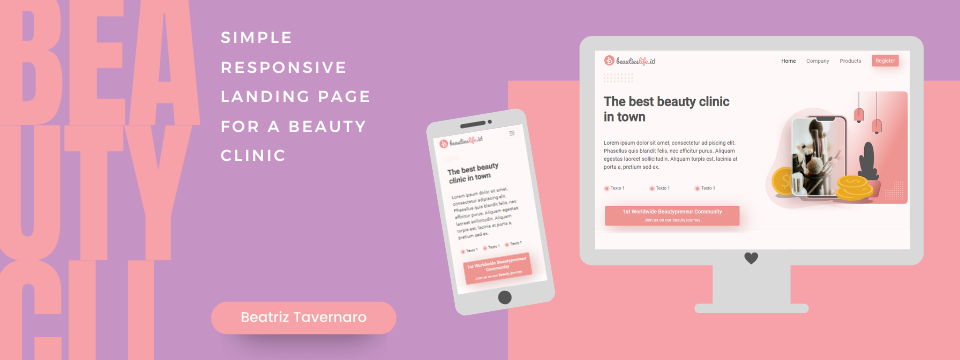

  

##
 

  
  
  

##

<h1 align="center"> - Landing page responsiva para uma clinica de estética - </h1>

 Olá! Esse é o meu primeiro projeto utilizando o Bootstrap. 
É uma pagina simples e sem muitos recursos, apenas para familiarização com o framework.   
Qualquer sugestão de melhoria, dicas e ideias são muito bem vindas!

<h4> - Futuros updates - </h4
 
 Pretendo implementar outras páginas e detalhes:  
  - Página Company  
  - Página Products  
  - Modal para cadastro de newsletter  
  - Animações em CSS e Javascript  
  - Mudança nos textos para um contexto real  
  
  ##
  
  Design @ Figma by Syabani Labs
